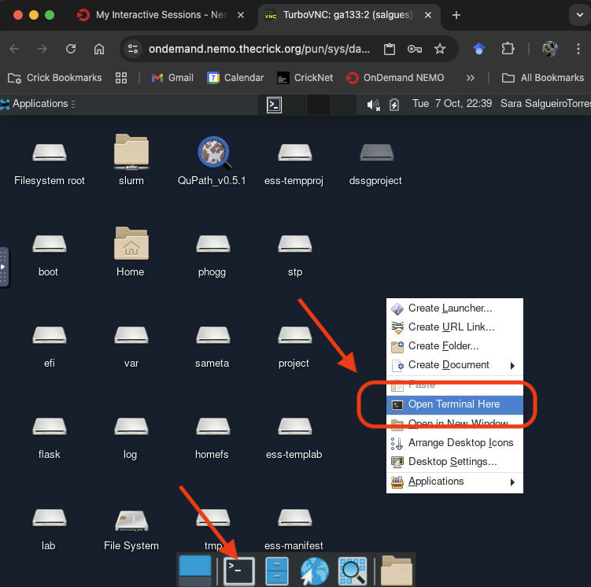
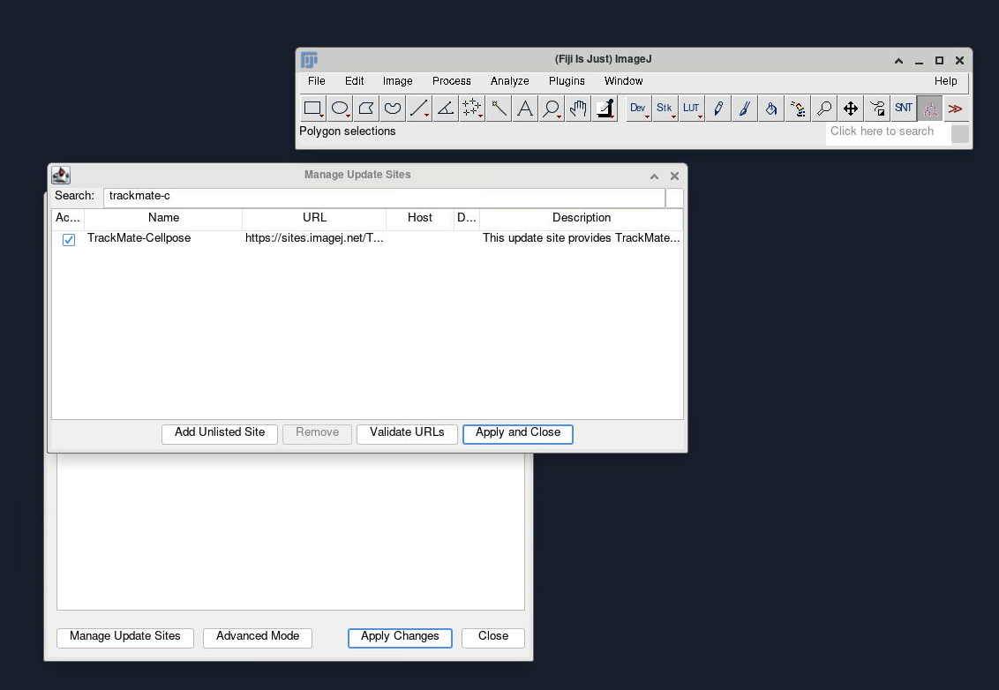
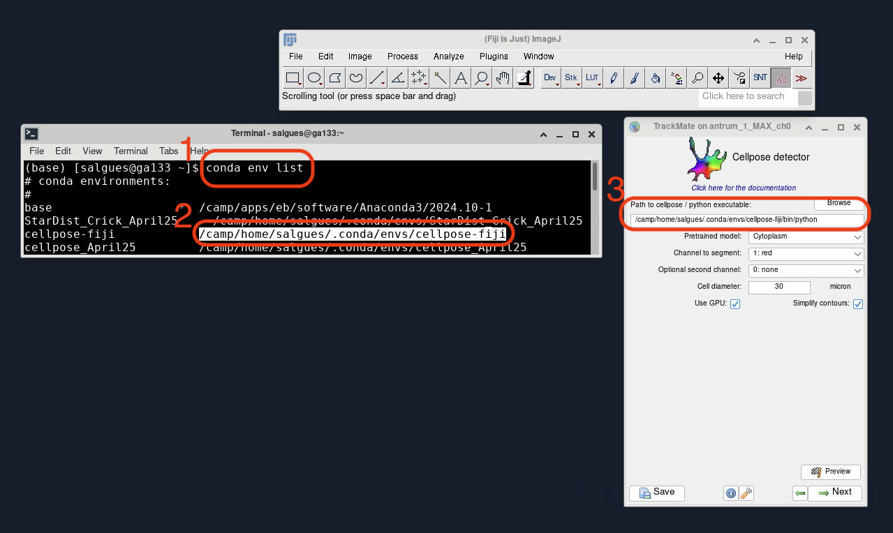

# How to install Cellpose for FIJI on OnDemand

[Cellpose](https://github.com/MouseLand/cellpose) is a general model for cell and nuclear segmentation. The following is a simple, step-by-step guide to installing Cellpose on [OnDemand](https://www.openondemand.org). More information on how to access OnDemand at the Crick can be found [in the wiki](https://wiki.thecrick.org/display/HPC/OnDemand).

> More detailed information on installing Cellpose can be found [here](https://github.com/MouseLand/cellpose?tab=readme-ov-file#installation) if needed.

> ⚠️ **BEWARE** – the FIJI wrapper only works for cellpose version 3.0 (and below). If you have a newer version, you will have to create a new separate cellpose environment for FIJI to access an older version of it (see instructions below).


## Step 1: Open Terminal
When your GPU OnDemand Desktop session starts, right click and select `Open Terminal Here` or click on the Terminal icon at the bottom of the desktop:



## Step 2: Load Anaconda
You need to set up a [conda](https://en.wikipedia.org/wiki/Conda_(package_manager)) environment, which will contain your Cellpose installation. To do this, you first need to load [Anaconda](https://en.wikipedia.org/wiki/Anaconda_(Python_distribution)). Type the following in your terminal window and press `Enter`:
```shell
ml Anaconda3
```

## Step 3: Create Cellpose environment
You then need to create the environment that will contain the Cellpose installation, using the following command:
```shell
conda create --name cellpose-fiji python=3.11
```
In this example, we assigned `cellpose-fiji` as the environment name (with the flag `--name`) and we requested version `3.11` for python. The terminal will produce output similar to the following, where `user_name` will be replaced with whatever your user name is:
```shell
Retrieving notices: ...working... done
Collecting package metadata (current_repodata.json): done
Solving environment: done
 
## Package Plan ##
 
environment location: /camp/home/user_name/.conda/envs/cellpose-env

Proceed ([y]/n)?
```
Press `y` and `Enter` to proceed when prompted.

## Step 4: Activate environment
Activate your new Cellpose environment with the following commands:
```shell
conda activate cellpose-fiji
```
> ⚠️ **NOTE** – the first time you use `conda`, this command might return an error suggesting you initialise `conda`. To do so, run `conda init` and then try again.

## Step 5: Install Cellpose
At this point, it is important to note that you have merely created what is essentially an empty environment called `cellpose-fiji`. To actually install Cellpose within this environment, run the following series of commands:
```shell
pip install cellpose==3.0
```
The terminal will produce a large amount of output as the necessary packages are installed.     Press `y` and `Enter` to proceed when prompted.

## Step 6: Verify installation
To test whether the installation was successful, run the following:
```shell
cellpose --help
```
If the installation was successful, this should produce a list of all the parameters that can be used when running Cellpose.

## Step 7: Deactivate environment
You can now deactivate your Cellpose environment by running the following:
```shell
conda deactivate
```
<br>

# Run Cellpose from FIJI
It is possible to run Cellpose directly from FIJI. Instructions for installing the necessary FIJI Plugin can be found [here](https://github.com/BIOP/ijl-utilities-wrappers?tab=readme-ov-file#ib-fiji---cellpose-wrapper).
Open FIJI. If you have never installed FIJI on your NEMO, follow [these instructions](../Fiji/readme.md).

## Setting up TrackMate Cellpose
The FIJI plugin [Trackmate](https://imagej.net/plugins/trackmate/) has a detector module that relies on [cellpose](https://imagej.net/plugins/trackmate/detectors/trackmate-cellpose) to segment cells in 2D. It is not included in TrackMate and must be installed separately. We can use the `cellpose-fiji` environment we just created.

### Step 1: Install the Trackmate-Cellpose plugin in FIJI
In FIJI, go to _Help > Update..._, which will open a window with the plugins that need updating. On the bottom left corner, slick on _Manage Update Sites_. Now you can look for _"TrackMate-Cellpose"_. Click on the check box and restart FIJI once it has been installed. 




### Step 2: Specify where cellpose lives when running TrackMate
Once you have your image open and select _Cellpose_ as your detector model of choice, you will be prompted with a window that asks for the **Path to Cellpose/Python executable**:
* You can easily find the path of your installation by going back to your Terminal/Anaconda Prompt and typing ```conda env list```.
* This should show you a list of all your available environments, `cellpose-fiji` should appear with an associated path.
* Copy and paste that into the TrackMate window, followed by `/bin/python`.
* Select your desired parameters, click _Next_ and use TrackMate as usual.
> ⚠️ **NOTE** – the path in the screenshot below will change from user to user.



---

# Run Cellpose as a Graphical User Interface (GUI)
To run the cellpose Graphical User Interface, you need to load VirtualGL before activating the conda environment for Cellpose. To load VirtualGL enter the following commands in the command line:
```shell
ml VirtualGL
```
Then you can run the Cellpose GUI:
```shell
conda activate cellpose-fiji
python -m cellpose
```

**NOTE – if you want to run the GUI with a 3D image**, you will instead have to run:
```shell
python -m cellpose --Zstack
```

Each step will take a few seconds
<br>

----

# Cite!
If you use Cellpose in your work, be sure to cite the relevant paper:
* Version 3 (Latest): Carsen Stringer and Marius Pachitariu. Cellpose3: one-click image restoration for improved cellular segmentation. _bioRxiv_ 2024.02.10.579780
* Version 2: Marius Pachitariu and Carsen Stringer. Cellpose 2.0: how to train your own model. _Nature methods_, 19(12):1634–1641, 2022.
* Version 1: Carsen Stringer, Tim Wang, Michalis Michaelos, and Marius Pachitariu. Cellpose: a generalist algorithm for cellular segmentation. _Nature methods_, 18(1):100–106, 2021.
