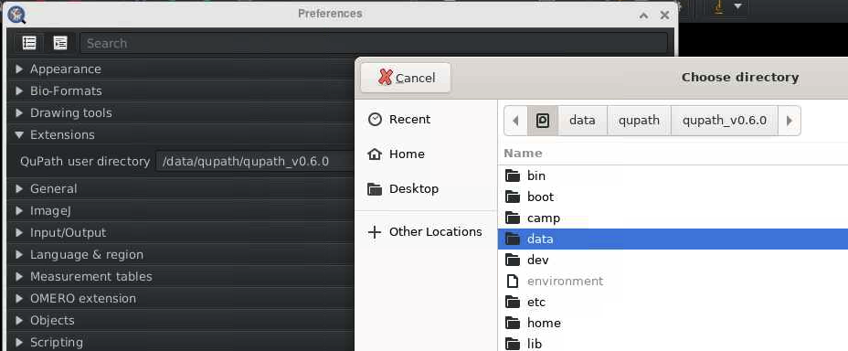

# Accessing QuPath 0.7.0 on the HPC Cluster

This guide will walk you through how to use **QuPath 0.7.0** on the Crick's HPC cluster. If you need help at any step, see [support section](#need-help-contact-us).

This version of QuPath requires some libraries that are not compatible with NEMO's. To solve this, QuPath runs in a "container" – a self-contained environment that has everything it needs.
So rather than installing it ourselves, it is available in the _apps_ folder in NEMO. These instructions will guide you on how to access it. 

---

## What is QuPath 0.7.0?
QuPath is a popular, open-source tool for digital pathology and whole slide imaging analysis. The new version (0.6.0) brings several new features and improvements.
To learn more about what's new, see:
[QuPath v0.7.0 release notes & features](https://github.com/qupath/qupath/blob/main/CHANGELOG.md#version-070)

---

### Step 1: Start a Desktop Session

1. Log in to the HPC cluster via [Open OnDemand](https://ondemand.nemo.thecrick.org).
2. Start a **Nemo desktop session** with the resources you need (CPU/GPU, memory...).

---

### Step 2: Open a Terminal

- Once your desktop session starts, open a **terminal window**.

---

### Step 3: Load the Singularity Module

Every time you open a new terminal, you must laod the Singularity module – the container platform.
Type the following and press Enter:

```bash
ml Singularity/3.11.3
```

---

### Step 4: Run QuPath

Replace `path/to/your/data` with the folder where your data/project/images are stored.

**a) If you are using a GPU node:**

```bash
singularity run --nv -B /path/to/your/data:/data /camp/apps/containers/QuPath/0.7.0/qupath_0.7.0.sif
```

**b) If you are NOT using a GPU node:**

```bash
singularity run -B /path/to/your/data:/data /camp/apps/containers/QuPath/0.7.0/qupath_0.7.0.sif
```

**Important:**
- You must replace `/path/to/your/data` with the actual path to your data on the cluster (for example, `/camp/lab/labname`).
- Your data will be accessible inside QuPath at the `/data` folder.

---

### Step 5: First-Time Setup – Select Your User Directory

The first time you open QuPath, you will be asked to select a **User Directory**.
- Please **create a new folder** (e.g., `qupath_v7`) inside your **lab-space directory** (not your home folder!).
-   - Example: `/camp/lab/labname/yourusername/qupath_v7`
- Select this folder as your User Directory.
- **Why?** The home folder has limited space and can fill up quickly! Extensions and plugins are installed here, so choose a location with enough storage.

---

## Accessing your data in QuPath

When you open a project/image or are selecting your user directory, a file browser window will appear. **Important**: this window opens in "Home" by default, so your home directory, but this is NOT where your data is located. 

Follow these steps to navigate to your data:

1. In the file browser, click on **"Other locations"** (on the left sidebar)
2. Select **"Computer"** to access the root file system.
3. Navigate to the **"data"** folder.


4. You will now see the path you specified when launching QuPath in the terminal (step 4). For example, `/camp/lab/labname`.
From here, you can navigate to your project files.

**Note:** once you navigate into the `/data` folder, you won't be able to navigate backwards to other system locations, so make sure the `/path/to/your/data` includes all the folders you need to access in your QuPath project.

---

## Need Help? Contact Us!

If you have any questions or run into any issues, we're here to help. Reach out to the Image Analysis team in CALM:

- **Email**: [bioimage-analysis@crick.ac.uk](mailto:bioimage-analysis@crick.ac.uk)
- **Slack**: #image-analysis
 
Happy analysing!

---
